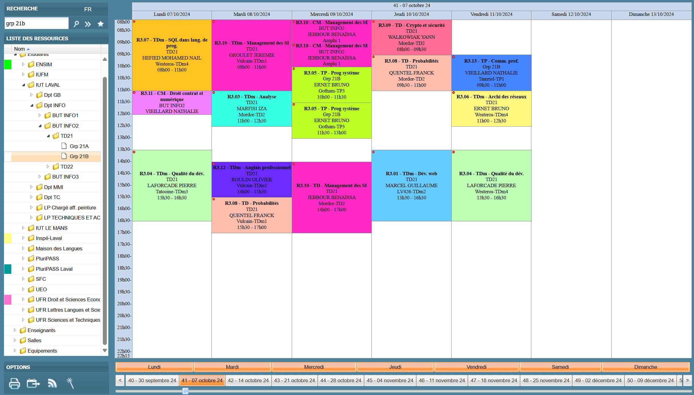
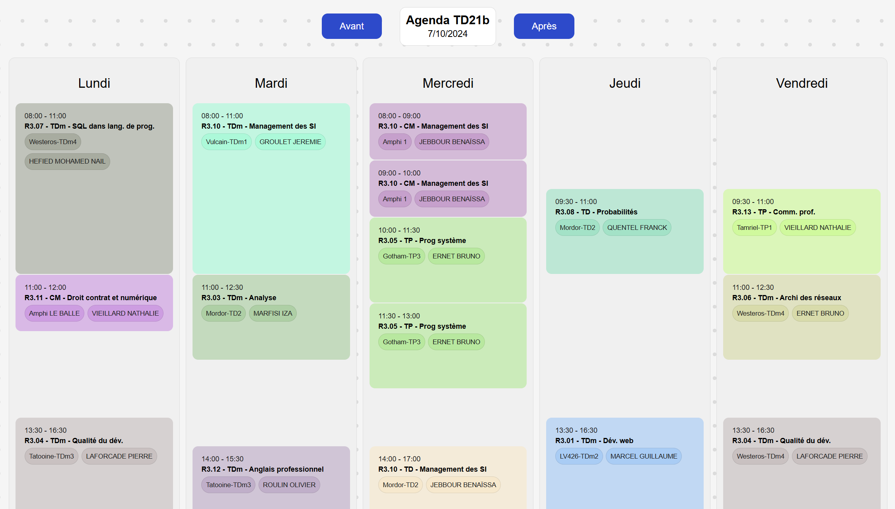

# 📅 Emploi du temps universitaire - IUT de Laval

Ce projet est le **frontend** pour l'affichage personnalisé de mon emploi du temps universitaire. Son objectif est de fournir une présentation plus esthétique et ergonomique que l'interface par défaut de l'IUT. Le site est accessible à l'adresse suivante : [edt.gemino.dev](https://edt.gemino.dev).

## 🌐 Frontend

Le frontend a été développé en **HTML**, **CSS**, et **JavaScript** dans le but de créer un prototype rapidement avec des technologies simples, tout en offrant une interface claire et agréable.

## 🔗 Backend

Le frontend récupère ses données à partir du backend Python, accessible dans un [dépôt distinct](https://github.com/ruffaultravenelg/planning_fetcher). Ce backend est responsable de :

- La collecte et de l'analyse quotidienne de l'emploi du temps.
- L'automatisation via une tâche cron exécutée sur un serveur.
- Les données sont sauvegardés dans un fichier JSON pour des raisons de simplicité.

## 📷 Comparaison

### Emploi du temps par défaut de l'ENT

### Frontend custom

## 📄 Licence

Ce projet est sous licence [GNU GPL v3.0](LICENSE).
